# Documintation of using Linux different commands

I have used **pwd** command to check where I am. Then I have created a new folder (directory) by **mkdir** command. Afterthat, I have used **cd** command to be in the new folder and I created a new file by **touch** command.
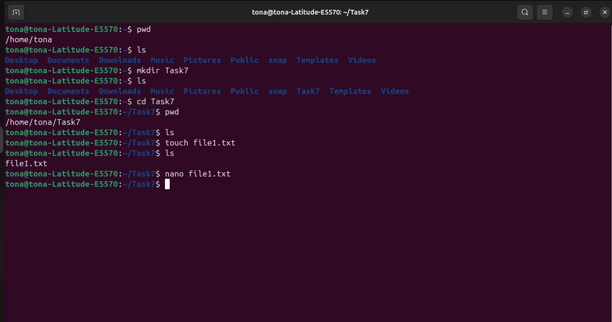

The **nano** command is used to open a file such as "file1.txt" to edit it. Also, I have used **cat** command to print what I have written in the file on the terminal.
There is another way to print sentance or anything on the terminal by using **echo** command.
Also, I have deleted file1.txt by using **rm** command.
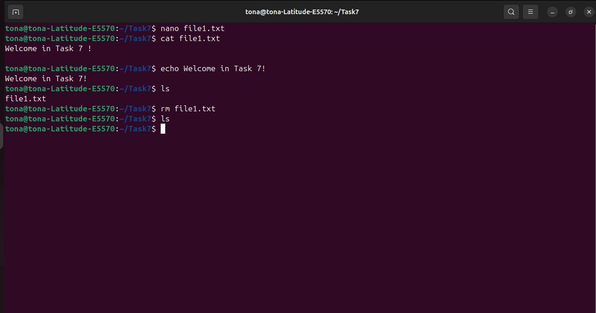

We can use differen tags with each command such as I have done with the command **ls**.
 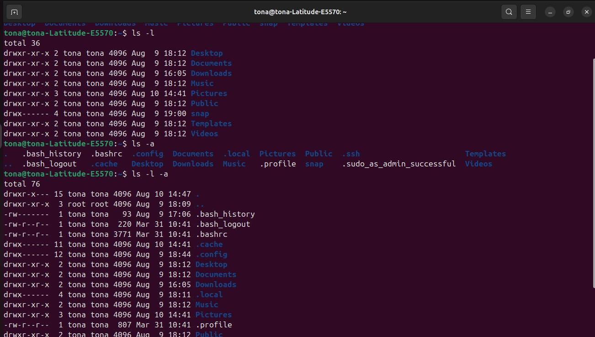

 I have deleted the directory "Task7" by using **rm -r** command
 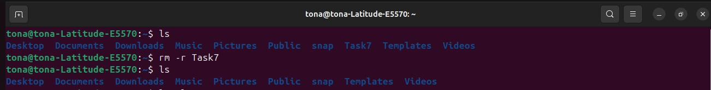

 I have searched in the output of **ls** command in a directory using **ls | grep ls** .
 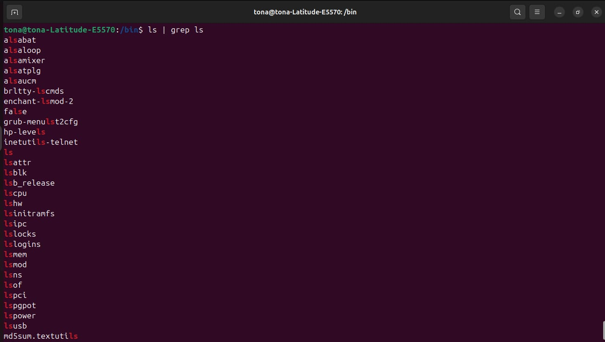

 I have created 2 directories "Task7" and "Training. Then I have created file.txt in each directory. Afterthat, I have copied file1.txt from directory "Task7" to directory "Training" using **cp [location] [distination]** command. 
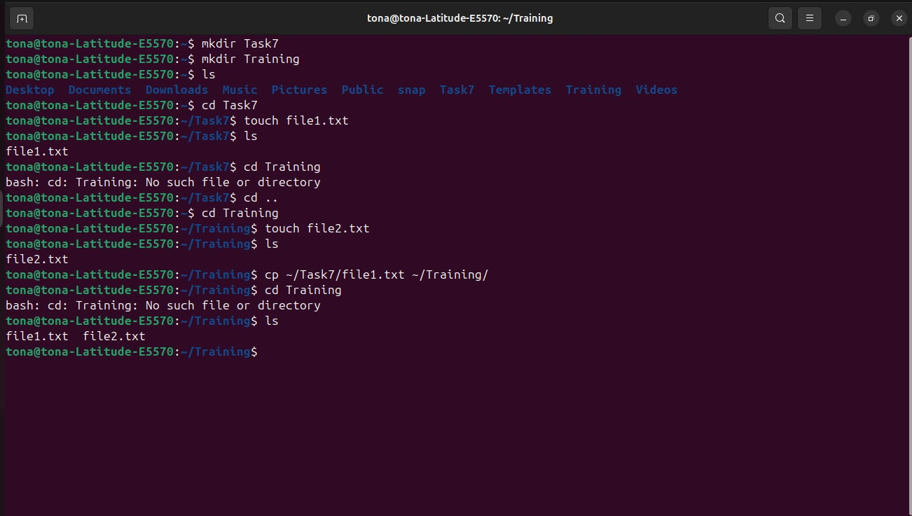

 I have tried the bash files. So, I have created a bash file in a directory, wrote some commands to be excuted in it. Then I have manipulated the permissions of r , w and x using **chmod** command. 
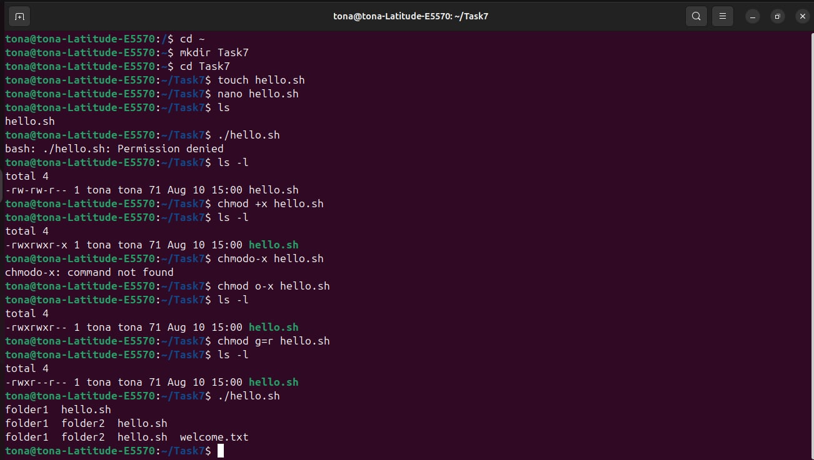
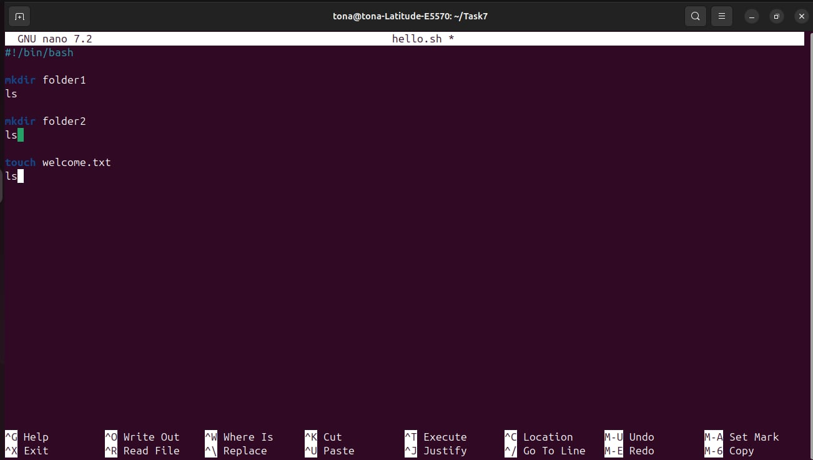

 Finally, I have tried the **ssh** command to connect with another server faraway from me. showing the files in it by using **ls** command and read the readme file in it by **nano** command.
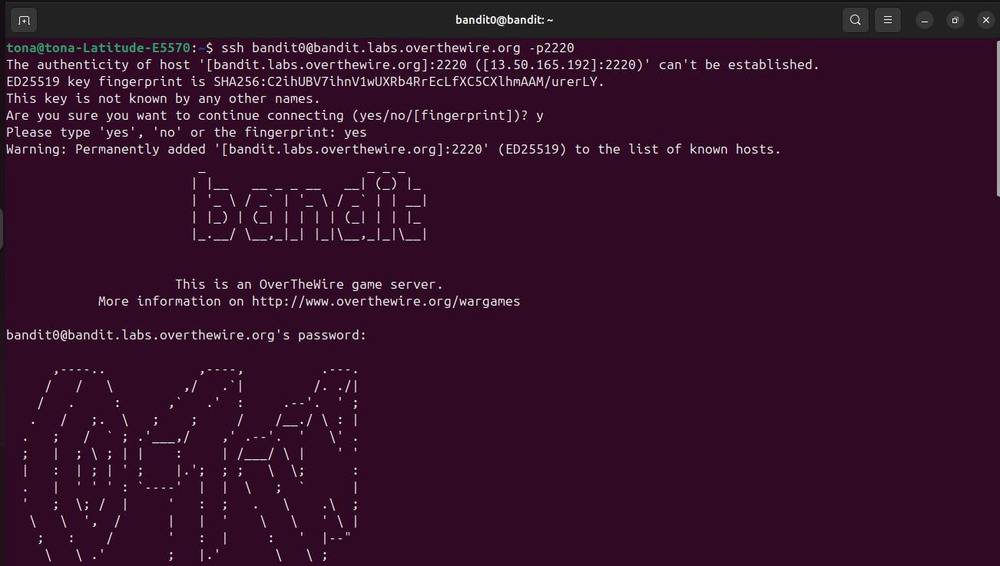
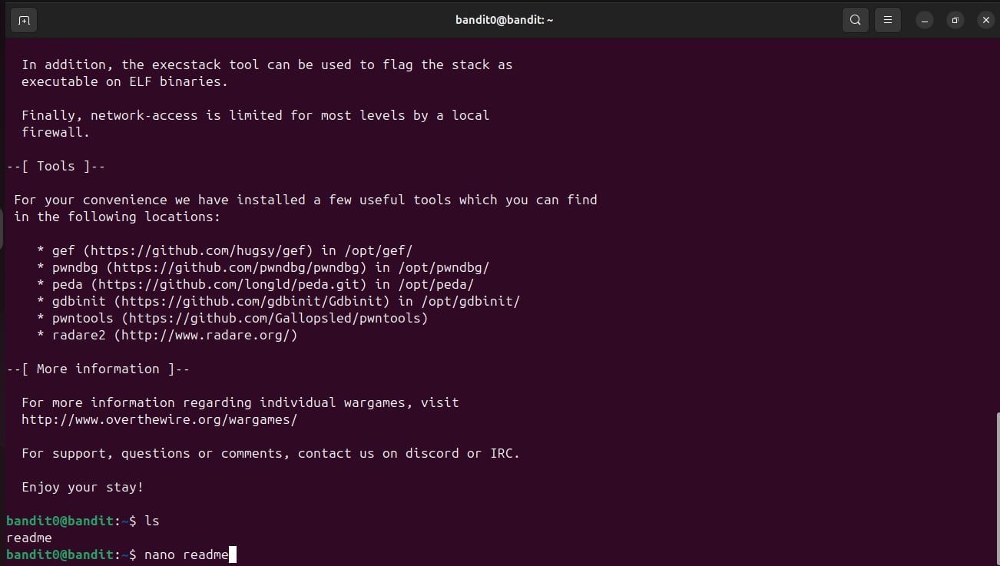
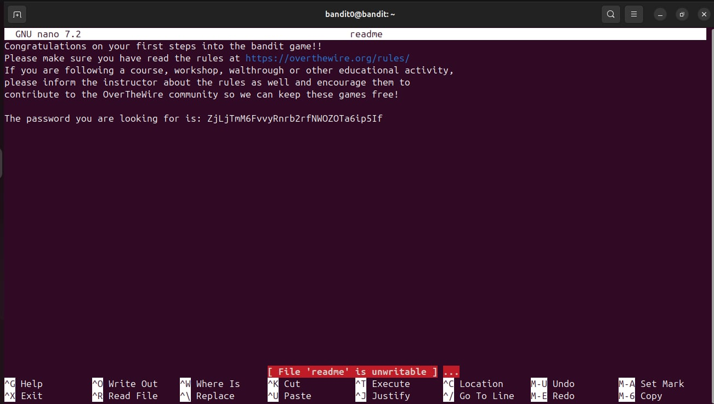